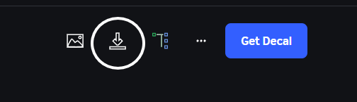
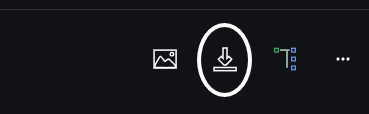
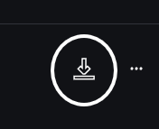
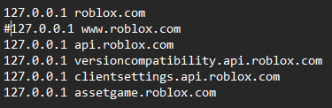
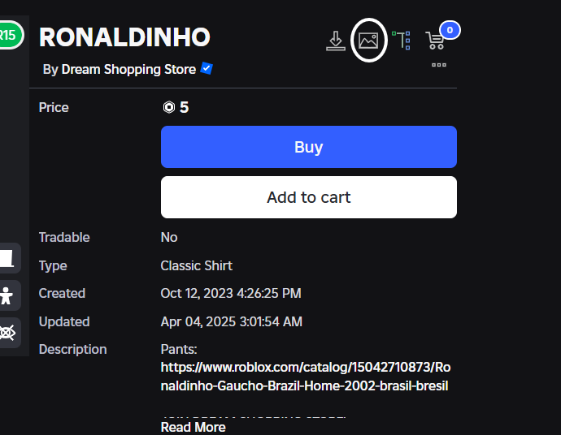

- Install BTRoblox Plugin from here: https://chromewebstore.google.com/detail/btroblox-making-roblox-be/hbkpclpemjeibhioopcebchdmohaieln
- Go to https://create.roblox.com/store/ and start searching.

# Decals
To Download **Decals**, Watch these steps:
1. Go to https://create.roblox.com/store/decals and find any decal you want.
2. Find this button and press it to download the image: 

3. Put the file inside assets folder and start **changefileextensions.bat**
4. Restart the studio for changes to be happen.

# Meshes
To Download **Meshes**, Watch these steps:
1. Go to https://create.roblox.com/store/meshparts and find any mesh you want.
2. Find this button and press it to download the mesh: 

3. Put the file inside assets folder and start **changefileextensions.bat**
4. Restart the studio for changes to be happen.

# Audios
To Download **Audios**, Watch these steps:
1. Go to https://create.roblox.com/store/audio and find any audio you want
2. Find this button and press it to download the mesh: 

3. Put the file inside assets folder and start **changefileextensions.bat**
4. Restart the studio for changes to be happen.

# Shirts / Pants
To Download **Shirts and Pants**, Watch these steps:
1. First of all comment out the **www.roblox.com** from your hosts file like this:

2. Go to https://www.roblox.com/catalog/ and choose any shirts or pants you want
3. Find this button and press it to download the image: 

4. Put the file inside assets folder and start **changefileextensions.bat**
5. Uncomment the **www.roblox.com** from your hosts file
6. Restart the studio for changes to be happen.

- For any other asset apply the same method.
- You can also fix the missing assets with these steps!
